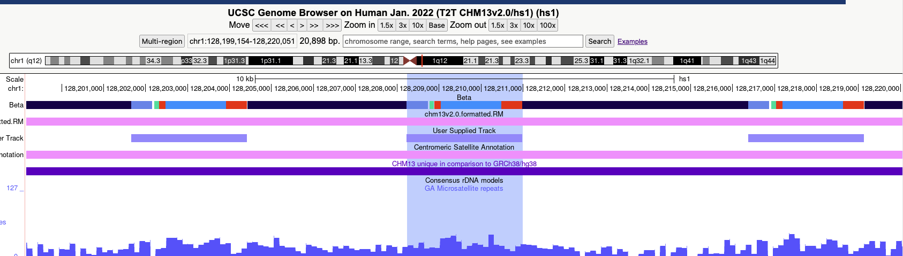
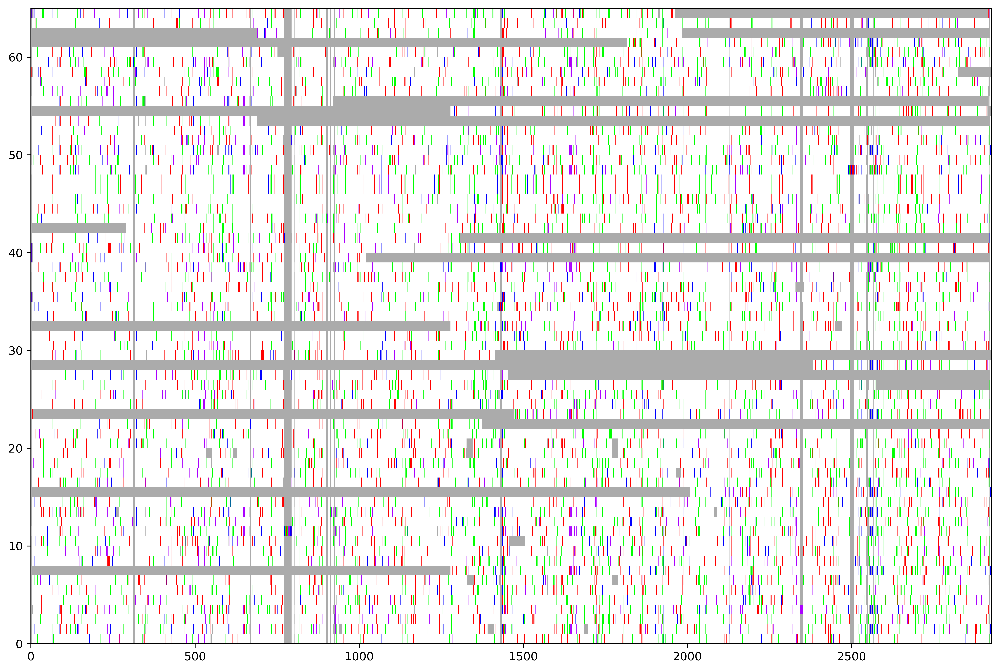
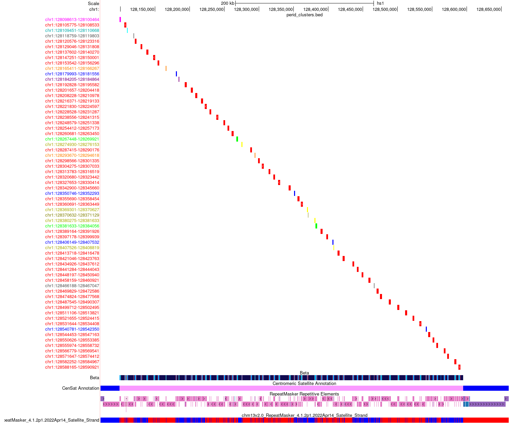
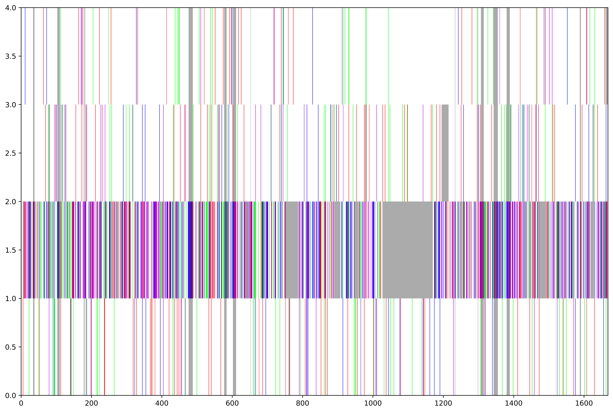
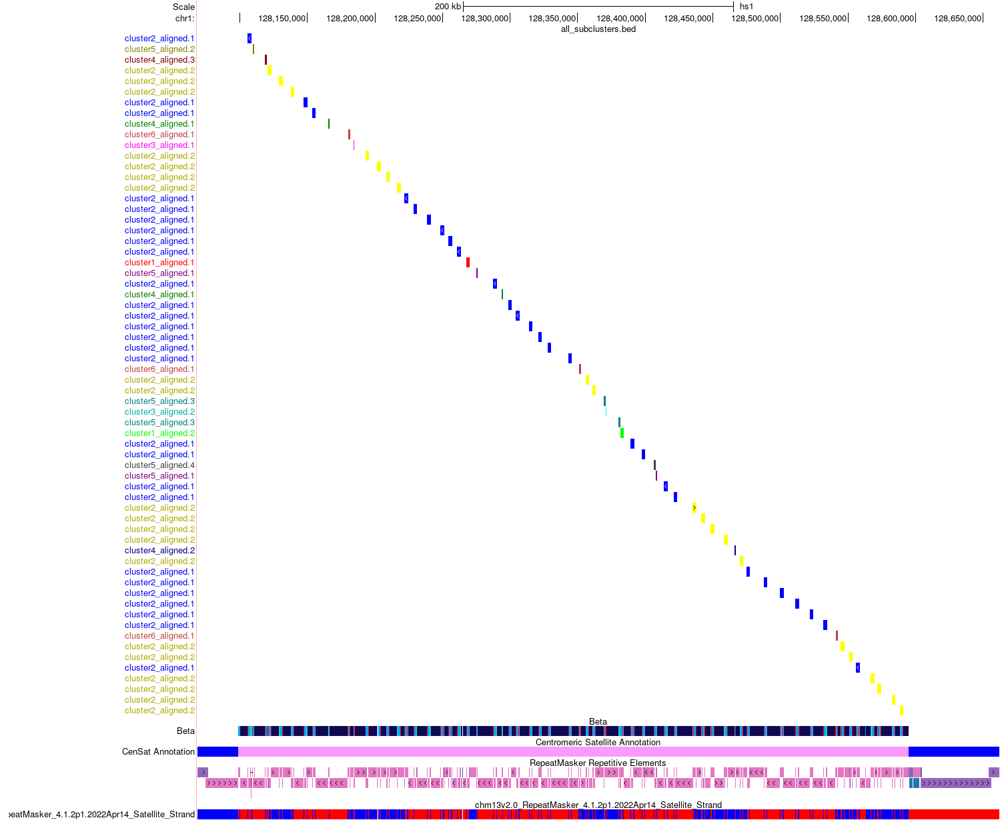
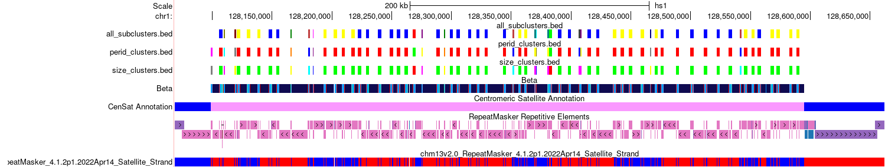

# Chromosome 1 Beta Satellite Array Analysis Notebook
### Name: Bhavna Mahi
### PI: Dr. Karen Miga
### Mentor: Hailey Loucks
### Institution: UCSC Genomics Institute - Miga Lab
### Working Directory: `bmahi@emerald:/private/groups/migalab/bmahi/chr1_bsat_project`
-------------------------------------------------------------------------------------------------

## Project Summary
- Project Official Title: Comprehensive Characterization of Beta Satellite Arrays on Human Chromosome 1 Reveals Novel Structural and Evolutionary Insights
- Project abstract can be found [here](https://docs.google.com/document/d/1pzUPFZEde6DgjhEcv6Fma618hGEK1DxywQc42l8xEko/edit?usp=sharing)

This project conducts an in-depth analysis of the beta satellite array that exists on chromosome 1. This array has yet to be studied to a detailed extent, mostly due to its highly inverted nature. This region, with its repetitiveness, and invertibility is notoriously difficult to examine. We plan to identify a singular repeat unit within the array that can be used to annotate the entire region. From these identified repeats, we will create clusters based on percent identity and build phylogenetic trees via hierarchical clustering. We will also color-code the various clusters so they can be mapped back onto the [UCSC Genome Browser](https://genome.ucsc.edu/index.html). This type of analysis will give us a better understanding of the spatial distribution and structural variances that may exist within the array. This could also inform the evolution of this array and set a foundation to study various beta satellite arrays in the genome.

## Mentor Meeting Notes
- Start identifying a possible repeat unit to train our HMM
- Familiarize yourself with HMMER, which we will use to build our HMM

## HMMER Notes
- Identify repeat unit -> get FASTA -> build HMM
- Notes from [HMMER user guide](http://eddylab.org/software/hmmer/Userguide.pdf):
    - `hmmbuild`: Train model on sequence data (page 31 of [user guide](http://eddylab.org/software/hmmer/Userguide.pdf))
    - `hmmsearch`: Identify repeat units with a provided FASTA (aka reference genome) (page 32-41 of [user guide](http://eddylab.org/software/hmmer/Userguide.pdf))
        - The most important part of output is the e-value which is the expected number of false positives (non-homologous sequences) -> the lower the values, the more significant the hit
        - E-value is based on sequence bit score (log-odds score for the complete sequence)
        - Bias: correction term for biased sequence composition -> only important if this value is large
    - Use `phmmer` if we're only considering the sequence of one repeat unit

## Building a HMM - Notes from Hailey Loucks
Here are my notes for building an hmm and searching a genome using HMMER. I typically use a conda install which you can find [here](https://anaconda.org/bioconda/hmmer). To start you need an alignment file of your sequence of interest. I use FASTA alignments that can look as simple as this:

```
>seq
AAATTTTGGG
>seq
AAATTTTGGG
```

You can have actual alignments (I use `muscle -super5`) though if you have a more complex set of starting sequences. I recommend playing around with it because it is pretty fast. Then you just use hmmbuild to create the model:

`hmmbuild myModel.hmm mySeq.alignment.fa`

That should create the `myModel.hmm` file. If you want to add multiple models to a single database you can do this:

```
hmmbuild myModel1.hmm mySeq1.alignment.fa
hmmbuild myModel2.hmm mySeq2.alignment.fa
cat *hmm> modelName
hmmpress modelName
```

Then you can search your genome of interest, these are my preferred parameters:

`time nhmmer --cpu 12 --notextw --noali --tblout genome.model.out modelName /path/to/genome.fa`

I then use this [script](https://github.com/enigene/hmmertblout2bed/blob/master/hmmertblout2bed.awk) to convert it into a BED file which is easier to work with:

`awk -v th=0.5 -f hmmertblout2bed.awk genome.out > genome.model.bed`

You can play around with the th=0.5 which is a filtering input. I keep it low at .5 to try to be pretty permissive. It's generally pretty fast though it can get slower the more models you have and the more contigs are in your assembly. You can probably retrofit my existing rDNA wdl pretty easily by just plugging in the new model you create.

## Key Annotations for [UCSC Genome Browser](https://genome.ucsc.edu/index.html)
- Beta Satellite Track CHM13v2.0: http://public.gi.ucsc.edu/~hloucks/betaSats/chm13.coloredBSAT.sorted.bed
- Beta Satellite Track HG002v1.1: http://public.gi.ucsc.edu/~hloucks/betaSats/hg002v1.1.coloredBSAT.sorted.bed
-  Satellite Strand Annotations: http://public.gi.ucsc.edu/~hloucks/CenSat/CHM13/chm13v2.0.labels.SatelliteStrand.bed

## Mentor Meeting Notes
- Find the smallest possible repeat unit
    - But try both small and large units for this array
    - Small units prevent overlap on the alignment
- Once a good repeat unit has been identified, use Fedor's script on monomers to build a tree
- The alignment fasta is just the same sequence repeated twice in the same FASTA file
- We might need more than one model for diverged arrays
- The HMM to BED th=0.5 parameter is used to filter out poor annotations
- We want the identified annotations to have some continuity in their size
- Perhaps try getting 2 sequences and align them for model training
- Use [NTRprism](https://github.com/altemose/NTRprism) for worst case scenario
- Filter out smaller repeat units for better viewing

## Model 1
- Directory: `bmahi@emerald:/private/groups/migalab/bmahi/chr1_bsat_project/model1`
- First model developed based on a repeat unit
- Repeat unit: `chr1:128121127-128129553`
    - Identified based on looking at [UCSC Genome Browser](https://genome.ucsc.edu/index.html) RepeatMasker Repetitive Elements Track
        - Seemed like a plausible repeat unit


- Repeat coordinates: `chr1_bsat_repeat.bed`
- Repeat FASTA: `chr1_bsat_repeat.fa`
- HMM: `chr1bsatModel.hmm`
- HMM output: `chr1bsatResults.out`
- HMM output->bed: `chr1bsatResults.bed`
- This repeat unit was not feasible
    - The annotations mapped back onto the [UCSC Genome Browser](https://genome.ucsc.edu/index.html) were highly fragmented

## Model 2
- Directory: `bmahi@emerald:/private/groups/migalab/bmahi/chr1_bsat_project/model2`
- Second model developed based on a new repeat unit
- Repeat unit: `chr1:128208227-128210978`
    - Attempted a smaller repeat unit based on the [UCSC Genome Browser](https://genome.ucsc.edu/index.html) GC Percent track
        - Target was the region with the highest GC percentage



- Repeat coordinates: `chr1_bsat_repeat_2.bed`
- Repeat FASTA: `chr1_bsat_repeat_2.fa`
- HMM: `chr1bsatModel2.hmm`
- HMM output: `chr1bsatResults2.out`
- HMM output->bed: `chr1bsatResults2.bed`
- This repeat unit was not feasible
    - The annotations mapped back onto the [UCSC Genome Browser](https://genome.ucsc.edu/index.html) skipped all BSR regions of the beta satellite array
- But it was the cleanest annotation generated so far

## Model 3
- Directory: `bmahi@emerald:/private/groups/migalab/bmahi/chr1_bsat_project/model3`
- Third model developed based on a new repeat unit
- Repeat unit: `chr1:128202208-128208727`
    - Attempted a repeat unit similar to Repeat Unit 2 that included the BSR region this time


- Repeat coordinates: `chr1_bsat_repeat_3.bed`
- Repeat FASTA: `chr1_bsat_repeat_3.fa`
- HMM: `chr1bsatModel3.hmm`
- HMM output: `chr1bsatResults3.out`
- HMM output->bed: `chr1bsatResults3.bed`
- This repeat unit was not feasible
    - The annotations mapped back onto the [UCSC Genome Browser](https://genome.ucsc.edu/index.html) were highly fragmented

## Mentor Meeting Notes
- Use Fedor's script to create graphs
    - Copy script from his directory: `/private/home/fryabov/soft/scripts/plot_alignment.py`
    - Run this script for Model 2 annotations
- Split up beta satellite into regions based on strand switches
    - Use Dr. Eizenga's [centrolign](https://github.com/jeizenga/centrolign/tree/main) to get percent identity between array regions
    - Generate ModDotPlot plots to compare all regions to each other and to compare each region to the entire array
        - Goal is to identify some homogeneity that can be used to narrow down a better repeat unit within the array
- Create a Markdown lab notebook to upload onto Github and keep track of progress

## Entire bsat Array vs Array Regions
- Directory: `bmahi@emerald:/private/groups/migalab/bmahi/chr1_bsat_project/alignmentPlots`
- Conduct alignments of the entire bsat array (self-self) via [ModDotPlot](https://github.com/marbl/ModDotPlot)
- Conduct alignments of inverting bsat regions with each other and with entire array
- Array coordinates: `chr1:128098616-128594818`
- Regional coordinates (Note: These are approximated.):
    - Region 1: `chr1:128098616-128118750`
    - Region 2: `chr1:128117571-128139959`
    - Region 3: `chr1:128138986-128178896`
    - Region 4: `chr1:128178410-128221726`
    - Region 5: `chr1:128221727-128269424`
    - Region 6: `chr1:128268938-128275265`
    - Region 7: `chr1:128274292-128350218`
    - Region 8: `chr1:128350219-128379421`
    - Region 9: `chr1:128379422-128435393`
    - Region 10: `chr1:128434421-128474817`
    - Region 11: `chr1:128473844-12854036`
    - Region 12: `chr1:128539064-128558045`
    - Region 13: `chr1:128557559-128562425`
    - Region 14: `chr1:128562426-128593575`


- **All comparison plots can be found on these [Google Slides](https://docs.google.com/presentation/d/1n2mXxZ9eIiZEDgAC4LCabdKH2VFiMvhhtLJoDDz_7is/edit?usp=sharing)**
    - No significant findings from these plots
- Percent identity results:
    - Seems that Region 11 is most similar with the entire array


- All array FASTAS stored here: `arrayFASTAS`
- All Entire Array vs Region plots here: `chr1BsatArrayvReg`
- All Region vs Region plots here: `invertedRegPlots`
- All [centrolign](https://github.com/jeizenga/centrolign/tree/main) alignments: `centrolign_alignments`
- Script that removes colons from plot file names so that transfer from remote server to local machine can occur: `cleanup_colons.sh`
- Script that calculates percent identity based on [centrolign](https://github.com/jeizenga/centrolign/tree/main) alignments: `calculate_centrolign_identity.sh`
    - Adds up all numbers before '=' symbol in alignment file (represents a match) and then divides by the longer sequence
    - Outputs results to specified target: `percentIdentity.txt`
- Script that automates the creation of ModDotPlot plots between the entire array and each region: `arrayFASTAS/mdpArrayAutomater.sh`
    - Need to activate ModDotPlot virtual environment to run: `source /private/groups/migalab/bmahi/ModDotPlot/mdpenv/bin/activate`
- Script that automates the creation of ModDotPlot plots between all the regions: `arrayFASTAS/mdpAutomater.sh`
    - Need to activate ModDotPlot virtual environment to run: `source /private/groups/migalab/bmahi/ModDotPlot/mdpenv/bin/activate`
- Temporary BED file to extract regions: `arrayFASTAS/tempExtract.bed`

## Mentor Meeting Notes
- Need to figure out -r flag that is optimal for entire array vs Region 6/13 and Region 6/6 + Region 13/13 self-self plots
    - These sequences are too small to work with default parameter `-r 1000`
- Try training an HMM model that trains on an aligned FASTA file with the unit from Model 2 and the BSR unit
- Use Fedor's script to create tree for Model 2 annotations

## Installing [MUSCLE](https://www.drive5.com/muscle/)
- Conda install instruction [here](https://anaconda.org/bioconda/muscle)
- Command for installation: `conda install -c bioconda muscle=5.1`
    - Assumes you have bioconda channel
    - Downloaded v5.1 since v5.3 was not compatible with remote server

## Model 4
- Directory: `bmahi@emerald:/private/groups/migalab/bmahi/chr1_bsat_project/model4`
- Utilizes repeat unit from Model 2 and BSR region
- Repeat unit from Model 2: `chr1:128208227-128210978`
- BSR unit: `chr1:128166269-128179688`
- Repeat coordinates: `chr1_bsat_repeat_2.bed` + `tempExtract.bed`
- Repeat FASTA: `chr1_bsat_repeat_2.fa` + `chr1_bsat_repeat_BSR.fa`
- Combined FASTA (with both sequences): `combined_seqs.fa`
    - Used this command to create this combined FASTA file: `cat chr1_bsat_repeat_2.fa chr1_bsat_repeat_BSR.fa > combined_seqs.fa`
- Combined FASTA after alignment: `combined_seqs_aligned.fa`
    - Used this command to create this aligned FASTA file: `muscle -super combined_seqs.fa -output combined_seqs_aligned.fa`
- HMM: `chr1bsatModel4.hmm`
- HMM output: `chr1bsatResults4.out`
- HMM output->bed: `chr1bsatResults4.bed`
- This repeat unit was not feasible
    - The annotations mapped back onto the [UCSC Genome Browser](https://genome.ucsc.edu/index.html) were highly fragmented

## Constructing Fedor's Plot for Model 2
- Directory: `bmahi@emerald:/private/groups/migalab/bmahi/chr1_bsat_project/model2`
- Constructing a plot using Fedor's script for Model 2 annotations since those were the cleanest we got despite missing the BSR region
- First I have to filter out smaller sequences in the Model 2 annotations relative to the others
    - Use this command to print sizes: `awk '{print $3 - $2}' chr1bsatResults2.bed | sort -n`
    - Smallest annotation: 172 bp
    - Largest annotation: 2783 bp
    - Most annotations were in the 1,000 to 2,000 range
    - Filtered out everything under 445 bp with: `awk '($3 - $2) > 445' chr1bsatResults2.bed > chr1bsatResults2_filtered.bed`
- Next I extracted out the sequences from the filtered bed file with the following command: `bedtools getfasta -fi ../chm13v2.0_chr1 -bed chr1bsatResults2_filtered.bed -fo chr1bsatResults2_filtered.fa`
    - This file contains 65 different sequences
- Then I want to use [MUSCLE](https://www.drive5.com/muscle/) to create an aligned FASTA file from the filtered FASTA file we just created: `muscle -super5 chr1bsatResults2_filtered.fa -output chr1bsatResults2_filtered_aligned.fa`
- Finally I use Fedor's plotting script to generate a plot:
    ```
    cp /private/home/fryabov/soft/scripts/plot_alignment.py ../
    python3 ../plot_alignment.py -a chr1bsatResults2_filtered_aligned.fa
    ```
- Resulting plot `chr1bsatResults2_filtered_aligned_alignment_plot.png`:



## Mentor Meeting Notes (02/14/2025)
- Fedor's plot is not super informative with all 65 sequences listed
    - Group sequences based on similarity (length, percent identity, etc.) into distinct clusters
    - Then redo plot for each cluster
    - Assign a different color to each cluster so the sequences can be plotted back onto the [UCSC Genome Browser](https://genome.ucsc.edu/index.html) for further analysis
- Presentation at Miga Lab Meeting on 03/31/2025
    - Explain what I did and why I did it
    - Build a narrative

## Uploading Notebook to GitHub
1. Go to GitHub and create a repository -> make public/private and add description
2. Travel to directory where project notebook is on local machine
3. Commands to run:
    ```
    git config --global user.email "bmahi@ucsc.edu"
    git config --global user.name "Bhavna Mahi"
    git init
    git add <file>
    git commit -m "Message"
    git branch -M main
    git remote add origin <link to repository>
    git push -u origin main
    ```
4. Directions to run for updating file in GitHub repository:
    - Open terminal and enter the folder of the GitHub repository/project you want to update
    - Type into terminal: `git add <file>` and then hit `enter`
    - Type into terminal `git status` and then hit `enter` (this step is optional)
    - Type into terminal `git commit -m ‘type any message here'` and then hit `enter`
    - Type into terminal `git push` and then hit `enter`

## Clustering To Do List
- Update centrolign_automater.sh to work with a singular input FASTA file that has multiple seqeunces instead of just a directory with individual FASTA files per sequence
    - Then update percent identity calculation script to calculate percent identity between each sequence
- Calculate sizes of each sequence 
- Try clustering based on size
- Try clustering based on percent identity

## Clustering
- Create two directories for different types of clustering
    - By size: `/private/groups/migalab/bmahi/chr1_bsat_project/model2/sizeClusters`
    - By percent identity: `/private/groups/migalab/bmahi/chr1_bsat_project/model2/peridClusters`
- Size clustering
    1. Extract seq sizes into a text file: `awk '/^>/ {if (seq) print length(seq); print $0; seq=""} !/^>/ {seq=seq $0} END {if (seq) print length(seq)}' ../chr1bsatResults2_filtered.fa | awk 'NR%2==0' > seqSizes.txt`
    2. Create python script to cluster based on size: `size_clustering.py`
        - File with clusters in csv format: `size_clusters.csv`
        - File with clusters in text format: `sizeClusters.txt`
        - Dendrogram: `size_clustering_dendrogram_colored.png`
    3. Create script to make a BED file that colors sequences based on cluster: `clusters_to_bed.py`
        - Load it into the UCSC GB with: `track name="SizeClusters" description="Size-based clusters" itemRgb="On"`


- Percent identity clustering:
    1. Copy my centrolign automation script to run alignments within one single FASTA file: `centrolign_automater.sh`
        - Creates a directory that contains all alignment text files: `alignments`
    2. Copy my percent identity calculation script to calculate percent identity using generated alignment files: `calculate_centrolign_identity.sh`
        - Creates a file that lists all percent identity between sequences: `pairwise_percent_identity.txt`
    3. Create a script to cluster sequences based on percent identity: `perid_clustering.py`
        - Creates a dendrogram of the clustering: `perid_clusters_dendrogram.png`
        - Also creates a `csv` file and a `txt` file with cluster assignments: `perid_clusters_assignments.csv`/`perid_clusters_assignments.txt`
    4. Write a script to create a BED file that colors sequences based on cluster assignments: `perid_clusters_to_bed.py`
        - Load it into the UCSC GB with: `track name='perid_clusters.bed' description='perid_clusters.bed'`



- Here is a side-by-side comparisons of both clustering visualizations:


## Recreate Fedor's Plots w/ New Clusters Per Cluster
- Commands to create these plots:
    ```
    # Create FASTA file with sequences from each cluster
    bedtools getfasta -fi ../chm13v2.0_chr1 -bed clusters.bed -fo cluster#.fa

    # Create aligned FASTA file with cluster#.fa
    muscle -super5 cluster#.fa -output cluster#_aligned.fa

    # Create Fedor's plot
    python3 ../plot_alignment.py -a cluster#_aligned.fa
    ```
- Create a script that automates the previous process: `clustering_workflow.py`
    - Creates the following files for each cluster:
        1. Cluster BED file
        2. Cluster FASTA file
        3. Cluster aligned FASTA file
        4. Fedor's Plot for each cluster
- Size clusters:

    Cluster 1
    

    Cluster 2
    

    Cluster 3
    

    Cluster 4
    

    Cluster 5
    

    Cluster 6
    

    Cluster 7 (only contains one sequence)
    

- Percent identity clusters:

    Cluster 1
    

    Cluster 2
    

    Cluster 3
    

    Cluster 4
    

    Cluster 5 (only contains once sequence)
    

    Cluster 6 (only contains once sequence)
    

    Cluster 7 (only contains once sequence)
    

    Cluster 8 (only contains once sequence)
    

    Cluster 9 (only contains once sequence)
    

    Cluster 10
    

    Cluster 11
    

    Cluster 12
    

    Cluster 13 (only contains once sequence)
    

    Cluster 14 (only contains once sequence)
    

## Cluster by Size then Percent Identity
- To get better cluster results, we will take our size based cluster, then cluster those further based on percent identity
- Create script that runs centrolign for all sequences within each of the 7 size clusters: `run_centrolign_for_size_clusters.sh`
    - Creates an output directory for each cluster and then populates those directories with centrolign alignment text files (example: `cluster2/alignments`)
- Create a script that calculates percent identity of all the sequences in each distinct cluster from our newly created alignment files: `compute_cluster_identity.py`
    - Creates a text file that lists all sequences comparisons with their percent identity in the individual cluster directories
- Create a script that clusters again based on the percent identities calculates in each size cluster: `subcluster_percent_id.py`
    - This script will create the following in each individual cluster directory:
        1. A text file that lists all subclusters and the sequences in each (i.e. Cluster 2.1, 2.2, 2.3, etc.)
        2. A csv file that lists all the sequences and the subcluster they belong to
        3. A dendrogram of the subclusters
    - Size cluster 7 will not produce any of this output since it contains only one sequence
    - 13 total subclusters identified
-  Create a script that creates a new BED file of all 65 sequences, but colors each distinct subcluster uniquely: `create_subcluster_bed.py`
    - Creates a BED file saved as `all_subclusters.bed`



- This looks like it might have more of an identifiable pattern within the array with the blue and yellow subclusters, but the transitional regions between this "pattern" seem to vary
- Below is a comparison of all BED files on the UCSC Genome Browser in this order: percent identity clusters, size clusters, subclusters of size clusters based on percent identity

