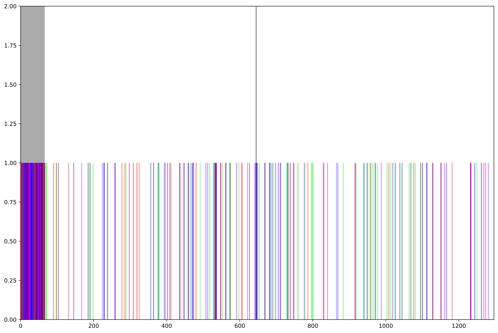
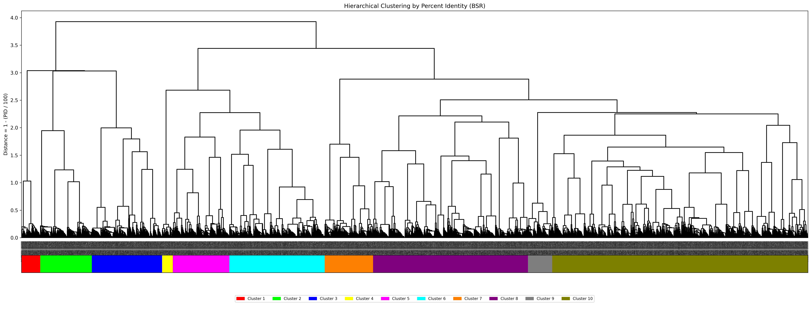

# Chromosome 1 Beta Satellite Array Analysis Notebook
### Name: Bhavna Mahi
### PI: Dr. Karen Miga
### Mentor: Hailey Loucks
### Institution: UCSC Genomics Institute - Miga Lab
### Working Directory: `bmahi@emerald:/private/groups/migalab/bmahi/chr1_bsat_project`
-------------------------------------------------------------------------------------------------

## Project Summary
- Project Official Title: Comprehensive Characterization of Beta Satellite Arrays on Human Chromosome 1 Reveals Novel Structural and Evolutionary Insights
- Project abstract can be found [here](https://docs.google.com/document/d/1pzUPFZEde6DgjhEcv6Fma618hGEK1DxywQc42l8xEko/edit?usp=sharing)

This project conducts an in-depth analysis of the beta satellite array that exists on chromosome 1. This array has yet to be studied to a detailed extent, mostly due to its highly inverted nature. This region, with its repetitiveness, and invertibility is notoriously difficult to examine. We plan to identify a singular repeat unit within the array that can be used to annotate the entire region. From these identified repeats, we will create clusters based on percent identity and build phylogenetic trees via hierarchical clustering. We will also color-code the various clusters so they can be mapped back onto the [UCSC Genome Browser](https://genome.ucsc.edu/index.html). This type of analysis will give us a better understanding of the spatial distribution and structural variances that may exist within the array. This could also inform the evolution of this array and set a foundation to study various beta satellite arrays in the genome.

## Mentor Meeting Notes
- Start identifying a possible repeat unit to train our HMM
- Familiarize yourself with HMMER, which we will use to build our HMM

## HMMER Notes
- Identify repeat unit -> get FASTA -> build HMM
- Notes from [HMMER user guide](http://eddylab.org/software/hmmer/Userguide.pdf):
    - `hmmbuild`: Train model on sequence data (page 31 of [user guide](http://eddylab.org/software/hmmer/Userguide.pdf))
    - `hmmsearch`: Identify repeat units with a provided FASTA (aka reference genome) (page 32-41 of [user guide](http://eddylab.org/software/hmmer/Userguide.pdf))
        - The most important part of output is the e-value which is the expected number of false positives (non-homologous sequences) -> the lower the values, the more significant the hit
        - E-value is based on sequence bit score (log-odds score for the complete sequence)
        - Bias: correction term for biased sequence composition -> only important if this value is large
    - Use `phmmer` if we're only considering the sequence of one repeat unit

## Building a HMM - Notes from Hailey Loucks
Here are my notes for building an hmm and searching a genome using HMMER. I typically use a conda install which you can find [here](https://anaconda.org/bioconda/hmmer). To start you need an alignment file of your sequence of interest. I use FASTA alignments that can look as simple as this:

```
>seq
AAATTTTGGG
>seq
AAATTTTGGG
```

You can have actual alignments (I use `muscle -super5`) though if you have a more complex set of starting sequences. I recommend playing around with it because it is pretty fast. Then you just use hmmbuild to create the model:

`hmmbuild myModel.hmm mySeq.alignment.fa`

That should create the `myModel.hmm` file. If you want to add multiple models to a single database you can do this:

```
hmmbuild myModel1.hmm mySeq1.alignment.fa
hmmbuild myModel2.hmm mySeq2.alignment.fa
cat *hmm> modelName
hmmpress modelName
```

Then you can search your genome of interest, these are my preferred parameters:

`time nhmmer --cpu 12 --notextw --noali --tblout genome.model.out modelName /path/to/genome.fa`

I then use this [script](https://github.com/enigene/hmmertblout2bed/blob/master/hmmertblout2bed.awk) to convert it into a BED file which is easier to work with:

`awk -v th=0.5 -f hmmertblout2bed.awk genome.out > genome.model.bed`

You can play around with the th=0.5 which is a filtering input. I keep it low at .5 to try to be pretty permissive. It's generally pretty fast though it can get slower the more models you have and the more contigs are in your assembly. You can probably retrofit my existing rDNA wdl pretty easily by just plugging in the new model you create.

## Key Annotations for [UCSC Genome Browser](https://genome.ucsc.edu/index.html)
- Beta Satellite Track CHM13v2.0: http://public.gi.ucsc.edu/~hloucks/betaSats/chm13.coloredBSAT.sorted.bed
- Beta Satellite Track HG002v1.1: http://public.gi.ucsc.edu/~hloucks/betaSats/hg002v1.1.coloredBSAT.sorted.bed
-  Satellite Strand Annotations: http://public.gi.ucsc.edu/~hloucks/CenSat/CHM13/chm13v2.0.labels.SatelliteStrand.bed

## Mentor Meeting Notes
- Find the smallest possible repeat unit
    - But try both small and large units for this array
    - Small units prevent overlap on the alignment
- Once a good repeat unit has been identified, use Fedor's script on monomers to build a tree
- The alignment fasta is just the same sequence repeated twice in the same FASTA file
- We might need more than one model for diverged arrays
- The HMM to BED th=0.5 parameter is used to filter out poor annotations
- We want the identified annotations to have some continuity in their size
- Perhaps try getting 2 sequences and align them for model training
- Use [NTRprism](https://github.com/altemose/NTRprism) for worst case scenario
- Filter out smaller repeat units for better viewing

## Model 1
- Directory: `bmahi@emerald:/private/groups/migalab/bmahi/chr1_bsat_project/model1`
- First model developed based on a repeat unit
- Repeat unit: `chr1:128121127-128129553`
    - Identified based on looking at [UCSC Genome Browser](https://genome.ucsc.edu/index.html) RepeatMasker Repetitive Elements Track
        - Seemed like a plausible repeat unit


- Repeat coordinates: `chr1_bsat_repeat.bed`
- Repeat FASTA: `chr1_bsat_repeat.fa`
- HMM: `chr1bsatModel.hmm`
- HMM output: `chr1bsatResults.out`
- HMM output->bed: `chr1bsatResults.bed`
- This repeat unit was not feasible
    - The annotations mapped back onto the [UCSC Genome Browser](https://genome.ucsc.edu/index.html) were highly fragmented

## Model 2
- Directory: `bmahi@emerald:/private/groups/migalab/bmahi/chr1_bsat_project/model2`
- Second model developed based on a new repeat unit
- Repeat unit: `chr1:128208227-128210978`
    - Attempted a smaller repeat unit based on the [UCSC Genome Browser](https://genome.ucsc.edu/index.html) GC Percent track
        - Target was the region with the highest GC percentage


- Repeat coordinates: `chr1_bsat_repeat_2.bed`
- Repeat FASTA: `chr1_bsat_repeat_2.fa`
- HMM: `chr1bsatModel2.hmm`
- HMM output: `chr1bsatResults2.out`
- HMM output->bed: `chr1bsatResults2.bed`
- This repeat unit was not feasible
    - The annotations mapped back onto the [UCSC Genome Browser](https://genome.ucsc.edu/index.html) skipped all BSR regions of the beta satellite array
- But it was the cleanest annotation generated so far

## Model 3
- Directory: `bmahi@emerald:/private/groups/migalab/bmahi/chr1_bsat_project/model3`
- Third model developed based on a new repeat unit
- Repeat unit: `chr1:128202208-128208727`
    - Attempted a repeat unit similar to Repeat Unit 2 that included the BSR region this time


- Repeat coordinates: `chr1_bsat_repeat_3.bed`
- Repeat FASTA: `chr1_bsat_repeat_3.fa`
- HMM: `chr1bsatModel3.hmm`
- HMM output: `chr1bsatResults3.out`
- HMM output->bed: `chr1bsatResults3.bed`
- This repeat unit was not feasible
    - The annotations mapped back onto the [UCSC Genome Browser](https://genome.ucsc.edu/index.html) were highly fragmented

## Mentor Meeting Notes
- Use Fedor's script to create graphs
    - Copy script from his directory: `/private/home/fryabov/soft/scripts/plot_alignment.py`
    - Run this script for Model 2 annotations
- Split up beta satellite into regions based on strand switches
    - Use Dr. Eizenga's [centrolign](https://github.com/jeizenga/centrolign/tree/main) to get percent identity between array regions
    - Generate ModDotPlot plots to compare all regions to each other and to compare each region to the entire array
        - Goal is to identify some homogeneity that can be used to narrow down a better repeat unit within the array
- Create a Markdown lab notebook to upload onto Github and keep track of progress

## Entire bsat Array vs Array Regions
- Directory: `bmahi@emerald:/private/groups/migalab/bmahi/chr1_bsat_project/alignmentPlots`
- Conduct alignments of the entire bsat array (self-self) via [ModDotPlot](https://github.com/marbl/ModDotPlot)
- Conduct alignments of inverting bsat regions with each other and with entire array
- Array coordinates: `chr1:128098616-128594818`
- Regional coordinates (Note: These are approximated):
    - Region 1: chr1    128098616       128118750
    - Region 2: chr1    128118751       128139959
    - Region 3: chr1    128139960       128178896
    - Region 4: chr1    128178897       128221726
    - Region 5: chr1    128221727       128269424
    - Region 6: chr1    128269425       128275265
    - Region 7: chr1    128275266       128350218
    - Region 8:chr1    128350219       128379421
    - Region 9: chr1    128379422       128435393
    - Region 10: chr1    128435394       128474817
    - Region 11: chr1    128474818       128534036
    - Region 12: chr1    128534037       128558045
    - Region 13: chr1    128558046       128562425
    - Region 14: chr1    128562426       128594818


- **All comparison plots can be found on these [Google Slides](https://docs.google.com/presentation/d/1n2mXxZ9eIiZEDgAC4LCabdKH2VFiMvhhtLJoDDz_7is/edit?usp=sharing)**
    - No significant findings from these plots
- Percent identity results:
    - Seems that Region 11 is most similar with the entire array


- All array FASTAS stored here: `arrayFASTAS`
- All Entire Array vs Region plots here: `chr1BsatArrayvReg`
- All Region vs Region plots here: `invertedRegPlots`
- All [centrolign](https://github.com/jeizenga/centrolign/tree/main) alignments: `centrolign_alignments`
- Script that removes colons from plot file names so that transfer from remote server to local machine can occur: `cleanup_colons.sh`
- Script that calculates percent identity based on [centrolign](https://github.com/jeizenga/centrolign/tree/main) alignments: `calculate_centrolign_identity.sh`
    - Adds up all numbers before '=' symbol in alignment file (represents a match) and then divides by the longer sequence
    - Outputs results to specified target: `percentIdentity.txt`
- Script that automates the creation of ModDotPlot plots between the entire array and each region: `arrayFASTAS/mdpArrayAutomater.sh`
    - Need to activate ModDotPlot virtual environment to run: `source /private/groups/migalab/bmahi/ModDotPlot/mdpenv/bin/activate`
- Script that automates the creation of ModDotPlot plots between all the regions: `arrayFASTAS/mdpAutomater.sh`
    - Need to activate ModDotPlot virtual environment to run: `source /private/groups/migalab/bmahi/ModDotPlot/mdpenv/bin/activate`
- Temporary BED file to extract regions: `arrayFASTAS/tempExtract.bed`

## Mentor Meeting Notes
- Need to figure out -r flag that is optimal for entire array vs Region 6/13 and Region 6/6 + Region 13/13 self-self plots
    - These sequences are too small to work with default parameter `-r 1000`
- Try training an HMM model that trains on an aligned FASTA file with the unit from Model 2 and the BSR unit
- Use Fedor's script to create tree for Model 2 annotations

## Installing [MUSCLE](https://www.drive5.com/muscle/)
- Conda install instruction [here](https://anaconda.org/bioconda/muscle)
- Command for installation: `conda install -c bioconda muscle=5.1`
    - Assumes you have bioconda channel
    - Downloaded v5.1 since v5.3 was not compatible with remote server

## Model 4
- Directory: `bmahi@emerald:/private/groups/migalab/bmahi/chr1_bsat_project/model4`
- Utilizes repeat unit from Model 2 and BSR region
- Repeat unit from Model 2: `chr1:128208227-128210978`
- BSR unit: `chr1:128166269-128179688`
- Repeat coordinates: `chr1_bsat_repeat_2.bed` + `tempExtract.bed`
- Repeat FASTA: `chr1_bsat_repeat_2.fa` + `chr1_bsat_repeat_BSR.fa`
- Combined FASTA (with both sequences): `combined_seqs.fa`
    - Used this command to create this combined FASTA file: `cat chr1_bsat_repeat_2.fa chr1_bsat_repeat_BSR.fa > combined_seqs.fa`
- Combined FASTA after alignment: `combined_seqs_aligned.fa`
    - Used this command to create this aligned FASTA file: `muscle -super combined_seqs.fa -output combined_seqs_aligned.fa`
- HMM: `chr1bsatModel4.hmm`
- HMM output: `chr1bsatResults4.out`
- HMM output->bed: `chr1bsatResults4.bed`
- This repeat unit was not feasible
    - The annotations mapped back onto the [UCSC Genome Browser](https://genome.ucsc.edu/index.html) were highly fragmented

## Constructing Fedor's Plot for Model 2
- Directory: `bmahi@emerald:/private/groups/migalab/bmahi/chr1_bsat_project/model2`
- Constructing a plot using Fedor's script for Model 2 annotations since those were the cleanest we got despite missing the BSR region
- First I have to filter out smaller sequences in the Model 2 annotations relative to the others
    - Use this command to print sizes: `awk '{print $3 - $2}' chr1bsatResults2.bed | sort -n`
    - Smallest annotation: 172 bp
    - Largest annotation: 2783 bp
    - Most annotations were in the 1,000 to 2,000 range
    - Filtered out everything under 445 bp with: `awk '($3 - $2) > 445' chr1bsatResults2.bed > chr1bsatResults2_filtered.bed`
- Next I extracted out the sequences from the filtered bed file with the following command: `bedtools getfasta -fi ../chm13v2.0_chr1 -bed chr1bsatResults2_filtered.bed -fo chr1bsatResults2_filtered.fa -s`
    - This file contains 65 different sequences
- Then I want to use [MUSCLE](https://www.drive5.com/muscle/) to create an aligned FASTA file from the filtered FASTA file we just created: `muscle -super5 chr1bsatResults2_filtered.fa -output chr1bsatResults2_filtered_aligned.fa`
- Finally I use Fedor's plotting script to generate a plot:
    ```
    cp /private/home/fryabov/soft/scripts/plot_alignment.py ../
    python3 ../plot_alignment.py -a chr1bsatResults2_filtered_aligned.fa
    ```
- Resulting plot `chr1bsatResults2_filtered_aligned_alignment_plot.png`:


## Mentor Meeting Notes (02/14/2025)
- Fedor's plot is not super informative with all 65 sequences listed
    - Group sequences based on similarity (length, percent identity, etc.) into distinct clusters
    - Then redo plot for each cluster
    - Assign a different color to each cluster so the sequences can be plotted back onto the [UCSC Genome Browser](https://genome.ucsc.edu/index.html) for further analysis
- Presentation at Miga Lab Meeting on 03/31/2025
    - Explain what I did and why I did it
    - Build a narrative

## Uploading Notebook to GitHub
1. Go to GitHub and create a repository -> make public/private and add description
2. Travel to directory where project notebook is on local machine
3. Commands to run:
    ```
    git config --global user.email "bmahi@ucsc.edu"
    git config --global user.name "Bhavna Mahi"
    git init
    git add <file>
    git commit -m "Message"
    git branch -M main
    git remote add origin <link to repository>
    git push -u origin main
    ```
4. Directions to run for updating file in GitHub repository:
    - Open terminal and enter the folder of the GitHub repository/project you want to update
    - Type into terminal: `git add <file>` and then hit `enter`
    - Type into terminal `git status` and then hit `enter` (this step is optional)
    - Type into terminal `git commit -m ‘type any message here'` and then hit `enter`
    - Type into terminal `git push` and then hit `enter`

## Clustering To Do List
- Update centrolign_automater.sh to work with a singular input FASTA file that has multiple seqeunces instead of just a directory with individual FASTA files per sequence
    - Then update percent identity calculation script to calculate percent identity between each sequence
- Calculate sizes of each sequence 
- Try clustering based on size
- Try clustering based on percent identity

## Clustering
- Create two directories for different types of clustering
    - By size: `/private/groups/migalab/bmahi/chr1_bsat_project/model2/sizeClusters`
    - By percent identity: `/private/groups/migalab/bmahi/chr1_bsat_project/model2/peridClusters`
- Size clustering
    1. Extract seq sizes into a text file: `awk '/^>/ {if (seq) print length(seq); print $0; seq=""} !/^>/ {seq=seq $0} END {if (seq) print length(seq)}' ../chr1bsatResults2_filtered.fa | awk 'NR%2==0' > seqSizes.txt`
    2. Create python script to cluster based on size: `size_clustering.py`
        - File with clusters in csv format: `size_clusters.csv`
        - File with clusters in text format: `sizeClusters.txt`
        - Dendrogram: `size_clustering_dendrogram_colored.png`
    3. Create script to make a BED file that colors sequences based on cluster: `clusters_to_bed.py`
        - Load it into the UCSC GB with: `track name="SizeClusters" description="Size-based clusters" itemRgb="On"`


- Percent identity clustering:
    1. Copy my centrolign automation script to run alignments within one single FASTA file: `centrolign_automater.sh`
        - Creates a directory that contains all alignment text files: `alignments`
    2. Copy my percent identity calculation script to calculate percent identity using generated alignment files: `calculate_centrolign_identity.sh`
        - Creates a file that lists all percent identity between sequences: `pairwise_percent_identity.txt`
    3. Create a script to cluster sequences based on percent identity: `perid_clustering.py`
        - Creates a dendrogram of the clustering: `perid_clusters_dendrogram.png`
        - Also creates a `csv` file and a `txt` file with cluster assignments: `perid_clusters_assignments.csv`/`perid_clusters_assignments.txt`
    4. Write a script to create a BED file that colors sequences based on cluster assignments: `perid_clusters_to_bed.py`
        - Load it into the UCSC GB with: `track name='perid_clusters.bed' description='perid_clusters.bed'`


- Here is a side-by-side comparisons of both clustering visualizations:


## Recreate Fedor's Plots w/ New Clusters Per Cluster
- Commands to create these plots:
    ```
    # Create FASTA file with sequences from each cluster
    bedtools getfasta -fi ../chm13v2.0_chr1 -bed clusters.bed -fo cluster#.fa

    # Create aligned FASTA file with cluster#.fa
    muscle -super5 cluster#.fa -output cluster#_aligned.fa

    # Create Fedor's plot
    python3 ../plot_alignment.py -a cluster#_aligned.fa
    ```
- Create a script that automates the previous process: `clustering_workflow.py`
    - Creates the following files for each cluster:
        1. Cluster BED file
        2. Cluster FASTA file
        3. Cluster aligned FASTA file
        4. Fedor's Plot for each cluster
- Size clusters:

    Cluster 1
    

    Cluster 2
    

    Cluster 3
    

    Cluster 4
    

    Cluster 5
    

    Cluster 6
    

    Cluster 7 (only contains one sequence)
    

- Percent identity clusters:

    Cluster 1
    

    Cluster 2
    

    Cluster 3
    

    Cluster 4
    

    Cluster 5 (only contains one sequence)
    

    Cluster 6 (only contains one sequence)
    

    Cluster 7
    

    Cluster 8 (only contains one sequence)
    

    Cluster 9
    

    Cluster 10 (only contains one sequence)
    

## Cluster by Size then Percent Identity
- Working directory: `/private/groups/migalab/bmahi/chr1_bsat_project/model2/sizeClusters/clusters`
- To get better cluster results, we will take our size based cluster, then cluster those further based on percent identity
- Create script that runs centrolign for all sequences within each of the 7 size clusters: `run_centrolign_for_size_clusters.sh`
    - Creates an output directory for each cluster and then populates those directories with centrolign alignment text files (example: `cluster2/alignments`)
- Create a script that calculates percent identity of all the sequences in each distinct cluster from our newly created alignment files: `compute_cluster_identity.py`
    - Creates a text file that lists all sequences comparisons with their percent identity in the individual cluster directories
- Create a script that clusters based on the percent identities calculates in each size cluster: `subcluster_percent_id.py`
    - This script will create the following in each individual cluster directory:
        1. A text file that lists all subclusters and the sequences in each (i.e. Cluster 2.1, 2.2, 2.3, etc.)
        2. A csv file that lists all the sequences and the subcluster they belong to
        3. A dendrogram of the subclusters
    - Size cluster 7 will not produce any of this output since it contains only one sequence
    - 10 total subclusters identified
-  Create a script that creates a new BED file of all 65 sequences, but colors each distinct subcluster uniquely: `create_subcluster_bed.py`
    - Creates a BED file saved as `all_subclusters.bed`


- This looks like it might have more of an identifiable pattern within the array with the blue and yellow subclusters, but the transitional regions between this "pattern" seem to vary
- Below is a comparison of all BED files on the UCSC Genome Browser in this order: percent identity clusters, size clusters, subclusters of size clusters based on percent identity


- Create a script that creates a Fedor plot for each of the subclusters (should be 13 total): `fedor_subclusters_workflow.py`
    - Workflow:
        1. Creates a new FASTA file for each subcluster
        2. Aligns each of these FASTA files with `muscle` to a new FASTA file
        3. Uses the aligned FASTA file to create a Fedor plot
        4. Places all Fedor plots in the `subcluster_Fedor_plots` directory
- See all plots below (note that any empty subcluster plot means that that subcluster has only 1 sequences in it):

    Subcluster 1:
    

    Subcluster 2:
    

    Subcluster 3:
    

    Subcluster 4:
    

    Subcluster 5:
    

    Subcluster 6:
    

    Subcluster 7:
    

    Subcluster 8:
    

    Subcluster 9:
    

    Subcluster 10:
    

    Subcluster 11:
    

    Subcluster 12:
    

    Subcluster 13:
    

- All different clusters vs array regions on UCSC Genome Browser:


## Mentor Meeting Notes (02/28/2025)
- Cluster BSRs then composites and see if there is a pattern there
    - Develop HMM to find 68-bp monomers to cluster
    - Include BSR regions near telomeric ends
        - Possible hints exchange between telomeric and pericentromeric regions for bSats
        - Stop analysis of these regions if they're super messy
    - BSRs might be more similar to alphas in terms of clean repeat units
    - Cluster by percent identity should be fine if all units are around 65-70 bp
        - Double check sizes
        - Exclude repeats that are super small
- Create a BED file of regions of chr1 bsat array
- Potentially include data from HG002
- Align arrays from chm13 vs HG002
    - We would have 2 arrays to compare in HG002 since it is diploid
- Redo model 2 cluster dendrograms, make them look nice for research paper
- Reorient previous size and percent identity clusters to match strand switches

## Model 5
- Directory: `bmahi@emerald:/private/groups/migalab/bmahi/chr1_bsat_project/model5`
- Fifth model developed to assess relationships between BSR units within the array
- Repeat unit: `GATCAGTGCAGAGATATGTCACAATGCCCCTGTAGGCAGAGCCTAGACAAGAGTTACATCACCTGGGT`
    - Retrived from Dfam: https://www.dfam.org/family/DF000000075/model
    - Had to split in half to get the 68 bp monomer
- Repeat FASTA: `chr1_bsr_repeat_5.fa`
- HMM: `chr1bsatModel5.hmm`
- HMM output: `chr1bsatResults5.out`
- HMM output->bed: `chr1bsatResults5.bed`
- Annotated sequences range from 22 to 80 bp (most are 60+ bp)
- Create a graph to show distribution of sequence lengths


- Set a threshold and filter sequences: `chr1bsatResults5_filtered.fa`
    - Keep sequences between 65-70 bp: `awk '{ if(($3 - $2) >= 65 && ($3 - $2) <= 70) print }' chr1bsatResults5.bed > chr1bsatResults5_filtered.bed`
    - 3874 total filtered sequences
- Extract all sequences in the filtered BED file to a FASTA file to begin alignment: `bedtools getfasta -fi ../chm13v2.0_chr1.fa -bed chr1bsatResults5_filtered.bed -fo chr1bsatResults5_filtered.fa -s`
- Remove all duplicate sequences in FASTA file to speed up alignment
    - `conda install bioconda::seqkit`
    - Run `seqkit rmdup -s < chr1bsatResults5_filtered.fa > chr1bsatResults5_filtered_rmdup.fa`
    - New file contains 3672 seqs
- Use `centrolign_automater.sh` to conduct pairwise alignment for all these sequences using centrolign
    - Output will be in `alignments`
- Use `calculate_centrolign_identity.py` to calculate percent identity of all pariwise alignments
    - Output will be in `peridClusters/pairwise_percent_identity.txt`
- Generate clusters based on percent identity with `perid_clustering.py`
    - Output will be written to a text and csv file with cluster ID's

## Mentor Meeting Notes (03/07/2025)
- Extract red cluster from percent identity cluster to see true structure
- Take note that with accounting for strand orientation the plots looked better
- For paper:
    - Build narrative -> why did you do what you did -> why -> why'd you do the next thing
- Consider another alignment algorithm for BSR units
    - muscle -super5
    - Clustal Omega
    - MAFFT -> install (https://anaconda.org/bioconda/mafft)
- Try clustering all the BSRs with Fedor's plot
- sbatch scripting (see example below)
    - Stick with basic parameters that Hailey has set (doesn't take too much mem)
    - Increase mem/cpu configurations to speed up runs
    - Modify output name
    - Make sure conda env is active in script because env variables are not present in the sbatch env
    - Add time command 
    - Increase in compute speed with sbatch

```
#!/bin/bash
#SBATCH --job-name=run_nonB_DNA.20231031
#SBATCH --partition=long
#SBATCH --mail-user=hloucks@ucsc.edu
#SBATCH --nodes=1
#SBATCH --mem=100gb
#SBATCH --ntasks=2
#SBATCH --cpus-per-task=1
#SBATCH --output=run_nonB_DNA.20231031.%j.log
#SBATCH --time=14-0:00

pwd; hostname; date
set -e

source /opt/miniconda/etc/profile.d/conda.sh
conda activate /private/home/mcechova/conda/nonB

/private/home/mcechova/non-B_gfa/gfa -seq /private/groups/migalab/hloucks/DeepLineage/datasets/verrko_cen12/cen12.all.fa -out verrko_cen12
/private/home/mcechova/non-B_gfa/gfa -seq /private/groups/migalab/hloucks/DeepLineage/datasets/verrko_cen10/cen10.all.fa -out verrko_cen10

for f in *gff ; do sed '1d' $f | awk '{print $1, ($4-1), ($5-1), $3, "0", $7, ($4-1), ($5-1), "0,0,0"}' OFS="\t" | sort -k1,1 -k2,2n > $f.bed ; done

echo "Done."
```

## BSR Clustering: 
- Working directory: `bmahi@emerald:/private/groups/migalab/bmahi/chr1_bsat_project/model5`
- Try clustering the `chr1bsatResults5_filtered_rmdup.fa` file with Clustal Omega
    - Job ID: [clustalo-I20250309-234033-0145-13985636-p1m](https://www.ebi.ac.uk/jdispatcher/msa/clustalo/summary?jobId=clustalo-I20250309-234033-0145-13985636-p1m)
    - All files saved to `model5_ClustalOmegaAlignment` directory
    - Create Fedor plot with the MAFFT aligned FASTA: `python ../../plot_alignment.py -a alignment_in_FASTA_format_Seqret.fa`
- Try MAFFT alignment for `chr1bsatResults5_filtered_rmdup.fa` on the command line as well
    - MAFFT manual page: https://mafft.cbrc.jp/alignment/software/manual/manual.html
    - Install MAFFT: `conda install bioconda::mafft`
    - Run alignment: `"/private/groups/patenlab/bmahi/miniforge3/bin/mafft"  --auto --inputorder "chr1bsatResults5_filtered_rmdup.fa" > "chr1bsatResults5_filtered_rmdup_MAFFT_align.fa"` (formulated command after selecting options with just `mafft`)
    - All files saved to `model5_MAFFTalignment`
    - Create Fedor plot with the MAFFT aligned FASTA: `python ../../plot_alignment.py -a chr1bsatResults5_filtered_rmdup_MAFFT_align.fa`
- Try clustering with MUSCLE on `chr1bsatResults5_filtered_rmdup.fa`
    - Command: `muscle -super5 chr1bsatResults5_filtered_rmdup.fa -output chr1bsatResults5_filtered_rmdup_MUSCLE_aligned.fa`
    - All files saved to `model5_MUSCLEalignment`
    - Create Fedor plot with the MUSCLE aligned FASTA: `python ../../plot_alignment.py -a chr1bsatResults5_filtered_rmdup_MUSCLE_aligned.fa`

Fedor Plot wtih Clustal Omega Alignment:


Fedor Plot with MAFFT Alignment:


Fedor Plot with MUSCLE Alignment:


- Create a script that is able to calculate percent identity between all sequences in the aligned FASTA files: `alignedFASTA_PIcalc.py`
    - This script uses pairwise percent identity (gaps ignored)
        - Only counts positions where neither sequences had a gap (-)
        - Positions where one or both sequnces have a gap are ignored
        - Example:
            ```
            Seq1: ACGT-GA
            Seq2: ACGTAGA
            Matches: 6/6 = 100% (ignores the `-`)
            ```
        - Formula: $$ \text{Percent Identity} = \left( \frac{\text{Matches}}{\text{Non-gap Positions Compared}} \right) \times 100 $$
    - Calculations:
        - Clustal alignment: `/private/groups/migalab/bmahi/chr1_bsat_project/model5/model5_ClustalOmegaAlignment/pairwise_percent_identity.txt`
        - MAFFT alignment: `/private/groups/migalab/bmahi/chr1_bsat_project/model5/model5_MAFFTalignment/pairwise_percent_identity.txt`
        - MUSCLE alignment: `/private/groups/migalab/bmahi/chr1_bsat_project/model5/model5_MUSCLEalignment/pairwise_percent_identity.txt`
- Calculate clusters with percent identity results
    - Copy over script from model2: `/private/groups/migalab/bmahi/chr1_bsat_project/model2/peridClusters/perid_clustering.py` and update paths for input/output
        - Clustal Omega: 139 clusters
        - MAFFT: 80 clusters
        - MUSCLE: 111 clusters
- Create a BED file with all sequences with designated clusters:
    - Copy over script from model2: `/private/groups/migalab/bmahi/chr1_bsat_project/model2/peridClusters/perid_clusters_to_bed.py`
    - Output BED files:
        - Clustal Omega: `model5_ClustalOmegaAlignment/perid_clusters_Clustal.bed`
        - MAFFT: `model5_MAFFTalignment/perid_clusters_MAFFT.bed`
        - MUSCLE: `model5_MUSCLEalignment/perid_clusters_MUSCLE.bed`
        - View on GB: https://genome.ucsc.edu/s/bmahi/chr1_bsat_array


- Recluster the BSRs so they have less overall clusters (no more than 20)
    - Edit script to max out at 20 clusters
    - Number of clusters:
        - Clustal Omega: 20
        - MAFFT: 20
        - MUSCLE: 20


## Model 2 Additional Clustering + Enhancements
- Cluster the red cluster from the percent identity clustering of Model 2
    1. Copy the cluster 1 (red cluster) sequences into a separate file
    2. Use that to create a percent identity file from those sequences (already calculated)
    3. Copy your clustering script into `perid_clustering_cluster1.py`
        - Modify input files
        - Stricter distance for cluster (clusters sequences >= 85% PI)
        - New clusters in `cluster1_assignments.txt`
    4. Copy cluster to bed script to create a new bed file for these clusters: `perid_cluster1_to_bed.py`
        - Output to `perid_cluster1.bed`


- Enhance the dendrograms for the clusters
    - Dendograms to include in paper:
        - PI clusters cluster 1 clusters (model 2)
        - BSR clusters (model 5)

## Pipeline Script Analysis: 

Please note that these steps are based on script analyses from Model 5 development. The script functionality is mostly the same across all models but can vary depending on your needs for each model.

**Step 1**:

Identify repeat unit of interest on the UCSC Genome Browser. Get the sequence of the repeat unit from the Genome Browser if possible, or otherwise create a temporary BED file with estimated repeat coordinates and use `bedtools` to extract sequence from CHM13v2.0 chr1 FASTA file. 

**Step 2**:

Once you have a FASTA file with the target repeat unit then modify the FASTA to have the same sequence repeat twice:
```
>seq
AAATTTTGGG
>seq
AAATTTTGGG
```

If you want to align 2 sequences together for an annotation, you put both sequence in a FASTA file and then create an aligned FASTA file using `muscle -super5`.

Then you just use hmmbuild to create the model:

`hmmbuild myModel.hmm mySeq.alignment.fa`

That should create the `myModel.hmm` file. Then you can search your genome of interest, these are my preferred parameters:

`time nhmmer --cpu 12 --notextw --noali --tblout genome.model.out modelName /path/to/genome.fa`

I then use this [script](https://github.com/enigene/hmmertblout2bed/blob/master/hmmertblout2bed.awk) to convert it into a BED file which is easier to work with:

`awk -v th=0.5 -f hmmertblout2bed.awk genome.out > genome.model.bed`

**Step 3**:

You can check to see if your new BED file is a clean annotation of the array by uploading it to the UCSC Genome Browser for viewing. If you're seeing clean, consistent, and complete annotations, you can move on. If you're seeing high fragmentation then you do not have a solid repeat unit.

**Step 4**: 

Now you want to use your newly created (and verified) BED file to create a FASTA file with all the annotated sequences with:

`bedtools getfasta -fi inputFASTA -bed BEDfile -fo outputFASTA -s`

You need the `-s` flag so you can pull the reverse complement of sequences on the minus strand for correct alignment. 

**Step 5**: 

Now you want to use an alignment tool to align all the sequences in your FASTA file. For all models, we used `centrolign`. However for Model 5, since there were so many sequences, we used different algorithms for compute efficiency such as `Clustal Omega`, `MUSCLE`, and `MAFFT` (no changes made to these algorithms).

Modified `centrolign` parameters:

1. Only query matches that occur at most this many times on either of the two graphs
`max_count`: 1500 (down from original 3000)

    This parameter sets how many times an anchor can appear in either sequence before it’s deemed too repetitive and discarded. By lowering `max_count` from 3000 to 1500:

    - Fewer extremely repetitive anchors: Anchors that occur more than 1500 times across the two sequences are skipped, meaning we discard very high-copy fragments that are likely not informative (or are alignment “noise”).

    - Better alignment specificity: Excluding those ultra-repetitive matches reduces spurious anchor chaining in repeated regions.

    - Balancing alignment speed: Fewer anchors pass the filter, so the alignment process runs more efficiently.

    Essentially, lowering max_count is a precision trade‐off: you ignore super‐high‐copy k‐mers or local repeats, which often helps in repetitive contexts so your aligner doesn’t over‐interpret those repeats as “valid anchors.”

2. The maximum number of matches between two graphs that will be considered during chaining
`max_num_match_pairs`: 625000 (down from original 1250000)

    `max_num_match_pairs` controls how many total anchor pairs can be retained for chain building.

    - Avoiding memory/time blow‐up: In highly repetitive or long regions, the number of potential anchor matches can skyrocket. Halving `max_num_match_pairs` to 625k helps manage large alignment tasks.

    - Streamlined chaining: With fewer match pairs, the chaining process is less likely to be overwhelmed by borderline or redundant anchors.

    Lowering this maximum count is another filter that effectively caps how many “anchor hits” pass to the chaining step, mitigating potential computational overhead in large or repeated sequences.

3. The method used to partition the anchor chain into alignable and unalignable regions:
    - 0: Do not attempt to partition; consider all sequences alignable
    - 1: Choose the highest scoring set of anchors
    - 2: Choose the highest scoring set of anchors, with each alignable segment having limit on its average value
    - 3: Choose the highest scoring set of anchors, with each alignable segment having limit on a windowed average value

    `constraint_method`: 0

    Centrolign offers multiple strategies (0 through 3) to partition the anchor chain into alignable vs. unalignable segments. Setting:

    0: Do not attempt to partition; treat all sequences as if they can align.

    Why choose “0”?

    - Simplicity: You tell the aligner not to skip or mask any sub-region. Instead, it attempts to align everything, possibly revealing partial alignments in complicated, repetitive blocks.

    - Fewer heuristics: The advanced partitioning modes (1–3) can sometimes skip or break up repetitive segments if they fail certain score thresholds. By disabling partitioning, you ensure you capture all potential alignment signals—especially if you’re exploring novel or poorly annotated repeats.

    In repetitive contexts, toggling this off might allow more direct control over how anchors chain, particularly if you’re manually adjusting other thresholds (like `max_count`, `max_num_match_pairs`).

4. The minimum total score that an alignable segment must have                                                        `minimum_segment_score`: 6500 (down from original 15000)

    This sets the lowest total alignment score for a segment to be considered alignable.

    - Lower threshold -> more segments pass: Reduces the minimum anchor‐chain “score” needed, allowing coverage of slightly lower‐similarity segments.

    - Capturing borderline repeats: If your array has moderate or partial matches, a lower threshold ensures those partial alignments survive, rather than being thrown out.

    - Better coverage in repeated arrays: In very repetitive or diverged regions, a high minimum score might prematurely exclude alignments, but a moderate setting like 6500 allows you to see more subalignments in mosaic or inversion blocks.

    Effectively, by reducing minimum_segment_score, you’re broadening the net to include subalignments that would previously fall below the alignment score “cut line.”

We conduct the alignment with an automated alignment script, `centrolign_automater.sh` that is outlined below:

1. **Command‐Line Argument Handling**  
   - Checks for exactly two arguments:  
     1) A multi‐sequence FASTA file containing all sequences of interest.  
     2) An output directory to store pairwise alignment results.  
   - Exits with a usage message if arguments are incorrect.

2. **Configuration Setup**  
   - Defines paths for the `centrolign` executable and its `config.yaml` file.  
   - Ensures the output directory exists (or creates it if needed).

3. **Extract Sequence Names**  
   - Uses `grep` for lines starting with `>` in the FASTA, removing the `>` to produce a file (`seq_names.txt`) with one sequence name per line.  
   - Loads these sequence names into an array (`seq_names`), counting how many sequences are found.

4. **Pairwise Alignment Loop**  
   - Iterates over each pair of sequences (i < j) so each pair is aligned once:
     - Avoids self‐self comparisons and duplicate reversed pairs.

5. **Temporary FASTA Construction**  
   - For each pair, an awk command extracts only those two sequences (by name) from the multi‐sequence FASTA into a temporary FASTA file.  
   - This ensures `centrolign` receives exactly those two sequences for alignment.

6. **Centrolign Config Updates**  
   - Dynamically replaces the `fasta_name:` field in `config.yaml` with the temporary FASTA path.  
   - Repeated for each new pair so `centrolign` always points to the correct 2-sequence file.

7. **Running Centrolign**  
   - Invokes `centrolign` with the updated config.  
   - Outputs each result to a `.txt` file named after the two sequences being compared (e.g., `seq1_vs_seq2.txt`).

8. **Cleanup & Reset**  
   - Deletes the temporary FASTA after each pairwise run.  
   - Resets `fasta_name:` in `config.yaml` back to `""` so subsequent loops start fresh.

9. **Completion Message**  
   - After all pairs have been processed, prints a message indicating that all pairwise alignments completed successfully.

**Step 6**:

After you have a directory of all the alignments, you want to calculate the percent identity between all the clusters. You can do this with a script called `calculate_centrolign_identity.py` outlined below:

1. **FASTA Parsing (`parse_fasta_lengths`)**  
   - Reads a multi‐sequence FASTA file (e.g., containing sequences like `>chr1:123-456`).  
   - Tracks the cumulative length for each sequence.  
   - Returns a dictionary mapping `sequence_name -> length` (e.g. `{"chr1:123-456": 3345, ...}`).

2. **Name Normalization (`underscore_to_colon`)**  
   - Converts a string such as `chr1_128105775-128108533` to `chr1:128105775-128108533`.  
   - Replaces the first underscore with a colon to unify naming between alignment files and the FASTA naming scheme.

3. **Summation of Matches from Alignment (`sum_matches_before_equals`)**  
   - Opens each alignment file (Centrolign output).  
   - Uses a regex (`(\d+)=`) to find all occurrences of digits preceding an "=" sign (e.g., `324=`).  
   - Sums those digits to determine the total number of matching bases in the alignment.

4. **Main Workflow**  
   - Load lengths: Calls `parse_fasta_lengths(FASTA_FILE)` to build a `{sequence_name -> length}` dictionary.  
   - Initialize output: Writes a header line ("Seq1\tSeq2\tPercent Identity") to a results file.  
   - Iterate alignment files: Looks for files matching `chr1*_vs_chr1_*.txt` in a specified alignment directory.  
   - Extract sequence names: For each alignment file name (e.g. `"chr1_128105775-128108533_vs_chr1_128109451-128110668.txt"`), it splits on `"_vs_"` and uses `underscore_to_colon` to restore the original colon format.  
   - Calculate percent identity:  
     1. Retrieves total matches from `sum_matches_before_equals`.  
     2. Looks up the lengths of the two sequences in the dictionary.  
     3. Computes `%ID = (total_matches / length_of_longer_seq) * 100`.  
     4. If either sequence name is missing in the FASTA dictionary or length is zero, outputs `"NA"`.  
   - Write results: Writes the final result line `Seq1_colon\tSeq2_colon\tPercentID%` (or NA) to the output file.

5. **Completion Message**  
   - After processing all alignment files, the script logs where the final results are saved.

**Step 7**:

Once you've calculated all the percent identities from the alignment directory, you can cluster and create a dendrogram based on the most closely related sequences. This can be done with the script `perid_clustering.py` outlined below:

1. **Script Purpose**  
   - Takes a file of pairwise percent identities (e.g., "chr1:12345-67890\tchr1:98765-99999\t92.50%") and converts them into a distance matrix where distance = 1 − (percent_identity/100).  
   - Uses hierarchical clustering (Ward’s method) to group these sequences, limiting to a maximum of 20 clusters (clustering varies by model).  
   - Plots a dendrogram and appends a color bar and legend to visualize cluster membership.

2. **Reading Pairwise Percent Identity**  
   - `PERCENT_FILE` is read into a `pandas DataFrame`.  
   - Trailing “%” is stripped, and the numeric values are interpreted as floating‐point.  
   - Collects all unique sequence names from the two columns (“Seq1”, “Seq2”).

3. **Distance Matrix Construction**  
   - Creates an NxN matrix for N total sequences.  
   - Fills each cell with `1 – (PercentIdentity/100)` to obtain the “distance.”  
   - Missing pairs (NaN) are replaced with a distance of 1.0, ensuring every pair has a valid distance.

4. **Hierarchical Clustering**  
   - Converts the full NxN matrix to a condensed distance vector via `squareform()`.  
   - Performs Ward’s linkage with `linkage(condensed_dist, method='ward')`.  
   - Limits the final clusters to 20 via `fcluster(Z, t=20, criterion='maxclust')` (clustering varies by model).

5. **Dendrogram Plotting**  
   - Creates a large figure with a main axis for the dendrogram.  
   - Sets `color_threshold=0` and `above_threshold_color='black'`, ensuring all branches are black.  
   - The x‐axis labels (sequence names) have a reduced font size to accommodate large sets of sequences.

6. **Cluster Assignments & Output**  
   - Saves cluster labels to a CSV (`perid_clusters_assignments.csv`).  
   - Also writes a human‐readable text file grouping sequences by cluster ID.

7. **Color Bar & Legend**  
   - Creates a 1×N color bar below the dendrogram, mapping each leaf node’s cluster to a distinct color (unique to Model 5).  
   - Defines a `cluster_color_map` for up to 20 clusters (RGB tuples or recognized color names) (also varies by model).  
   - Renders a small color legend listing each cluster and its corresponding color.

8. **Final Figure Save**  
   - Combines the dendrogram, color bar, and legend into one figure.  
   - Exports as a high‐resolution `.png`, concluding the script.

Please note that a similar method is used to cluster based on size of the sequences in Model 2. The only difference is that the criteria for clustering is sequence length and not percent identity.

---

**Ward’s Method**:

Ward’s method is a specific type of agglomerative hierarchical clustering that focuses on minimizing the total within‐cluster variance (or sum of squared distances) at every merge step. Below is a detailed discussion of how it operates and why it is suited for clustering repetitive sequence identity data.

**How Ward’s Method Works**:

1. **Initialization**  
   - Each sequence (data point) starts in its own cluster.

2. **Iterative Merging**  
   - At each iteration, Ward’s method merges the two clusters that produce the smallest increase in the total within‐cluster sum of squares (variance).  
   - Concretely, if merging two clusters leads to a bigger “jump” in the sum of squared distances within that newly formed cluster, it is less favorable. The algorithm picks the pair that increases that sum the least.

3. **Distance Metric**  
   - In this pipeline, $ distance = (1 - percentID * {100}) $. Therefore, clusters containing sequences with higher identity have a smaller sum of distances (and smaller variance), driving the merges.

4. **Hierarchy**  
   - The process continues until all points end up in a single cluster. The “hierarchical” aspect yields a dendrogram, which we can cut (or set a max number of clusters) to define final groupings.

**Why Ward’s Method for Our Purposes**:

1. **Minimizing Variance -> Cohesive Clusters**  
   - Because Ward’s method explicitly minimizes within‐cluster variance, it naturally forms compact, cohesive groups of sequences. In the case of satellite repeats, it means sequences with the highest mutual identity are more decisively clustered together than they might be under single or complete linkage.

2. **Robust Handling of Partial Divergence**  
   - Beta satellites often have partial homologies, inversions, or moderate divergence. Methods like single linkage can chain distant sequences via one linking edge, while complete linkage can be too strict in certain repetitive contexts.  
   - Ward’s strikes a balance that respects the overall distribution of pairwise distances within each cluster, typically forming more interpretable subclades.

3. **Interpretability**  
   - By measuring changes in the sum of squares, Ward’s merges are more systematic and yield a smooth dendrogram structure. Extremely unbalanced merges are less common, making it easier to spot well‐defined clusters of sequences that share stronger identities.

4. **Widely Used in Genomics**  
   - In many biological clustering scenarios (e.g., gene expression or sequence similarity), Ward’s approach is popular for its variance‐minimizing objective. It helps highlight patterns that reflect strong internal similarity—exactly what we want when grouping repeats into meaningful families or subgroups.

**Step 8**:

Once you have all your clusters defined, you need to recreate a BED file where each sequence is colored based on the cluster that it is in. You can do this with a script called `perid_clusters_to_bed.py` outlined below:

1. **Script Purpose**  
   - Merges cluster assignment data (from a CSV) with the original BED (which contains strand information) to generate a color‐coded final BED.  
   - Preserves the correct orientation (+/−) from the original BED while assigning each sequence an RGB color representing its cluster membership.

2. **Inputs**  
   1. ORIGINAL_BED: A BED file that includes at least 6 columns (chrom, start, end, name, score, strand, …). This is critical because we must preserve the strand info.  
   2. CLUSTER_CSV: A file with lines like “Sequence,Cluster,” for example:  
      ```
      chr1:128105775-128108533,1
      chr1:128327653-128330414,2
      ```
   3. OUTPUT_BED: The path to write the new, colorized BED.

3. **Generate Unique Colors**  
   - A helper function, `generate_unique_color_map(num_colors=80)`, randomly creates up to 80 unique RGB colors in the format `R,G,B` (or if you have specific colors for specific clusters then you can copy over a color map).  
   - This ensures each cluster ID can receive a distinct color.

4. **Load Strand Info**  
   - Reads ORIGINAL_BED line by line, building a dictionary keyed by `"chr:123-456"` -> `(chrom, start, end, strand)`.  
   - Ensures each sequence name can be matched to a specific orientation from the original data.

5. **Process Cluster Assignments**  
   - Opens the CLUSTER_CSV, reading each row as `Sequence` (e.g., `"chr1:128105775-128108533"`) and a `Cluster` ID (integer).  
   - For each sequence, looks up `(chrom, start, end, strand)` from the dictionary.  
   - Retrieves a color from the color map (`color_map`) based on the cluster ID.

6. **Write Final BED**  
   - Produces a 9‐column BED line for each sequence, filling:  
     1. `chrom`  
     2. `start`  
     3. `end`  
     4. `name` (the sequence name)  
     5. `score` (set to "0")  
     6. `strand` (taken from the original bed’s 6th column)  
     7. `thickStart` (set to `start`)  
     8. `thickEnd` (set to `end`)  
     9. `itemRgb` (the chosen color string like `"255,0,0"`)  
   - Writes these lines to OUTPUT_BED.  
   - Optionally logs warnings for any sequence absent in the dictionary (e.g., if the CSV references a name not found in `ORIGINAL_BED`).

7. **Result**  
   - The resulting BED file can be uploaded to the UCSC Genome Browser with `itemRgb="On"`, yielding strand‐aware intervals color‐coded by cluster ID.

## cenHap Meeting (03/25/2025)
- From Julian L.:
    - Recreate your Fedor plots with your tree on the left axis so that the sequences are displayed together by cluster
    - On the HG002 replication, the paternal haplotype has an extra beta array on chr1, so do the analysis there as well (we should see something different in this array)
- In the cenHap paper:
    - Beta sat annotation could go in the beginning of the paper where we do a high level analysis of chr1 hsat/beta structural polymorphisms

## Chromosome Map (Clustal Omega)
- Used Hailey's script to create a map of Clustal Omega cluster annotations on chr 1


# To Do List (Week of 3/31)
- Need to do BSR clustering with just 10 clusters
- Need to recreate BSR Fedor plot ordered by cluster with dendrogram on left axis
    - This will confirm clustering results
- Need to start analysis of HG002

# Redo BSR Clustering with 10 Clusters
- Need to change this line of the `perid_clustering_Clustal.py` script:
    
    `cluster_labels = fcluster(Z, t=20, criterion='maxclust')` to
    `cluster_labels = fcluster(Z, t=10, criterion='maxclust')`
- Need to change all output notation to: `perid_10clusters*`
    - Need to change input notations in `perid_clusters_to_bed.py` to match above


- It is much easier now to see a pattern on the Clustal track




# Mentor Meeting Notes (04/11/2025)
- Focus on BSR model only for now
- Fix up Fedor plots
- For each cluster identify consensus sequence
    - Get consensus sequence for each cluster by pulling all into a separate FASTA
    - Make models specific to each cluster
        - Extract alignments for model 1
        - Build an HMM from this alignment OR extract consensus sequence and train on that
            - Try both methods
        - Goal is to understand the differences between clusters, what is the variation between clusters (will be better understood with the adjusted Fedor plots)
    - Ask for more samples if needed to prevent overfitting on CHM13 and HG002
- Annotate the HG002 genome with the models developed for each cluster
- Future direction: how are we going to annotate the entire HPRC with respect to population genetics
    - Careful about how we identify SNPs within smaller BSR repeats
    - How can we scale up to the HPRC
        - How can be optimize tree building for a larger scale genome
- Read SST1 paper to get an idea of the type of analysis we want to do (or other satellite phylogeny model)
    - Questions we're trying to answer: what's new, what's old, what's shared, where are the variations
    - Build tree of all beta sats for HPRC like done in Yang paper

# Fedor Plot Alignments
- Create a copy of plotting script called `plot_alignment_COPY.py`
- Command to run:

```
python ../../plot_alignment_COPY.py \
  --alignment  alignment_in_FASTA_format_Seqret.fa \
  --pid_table  pairwise_percent_identity.txt \
  --output_prefix  Clustal_BSR_Alignment_10Clusters_Clusters \
  --max_clusters 10 \
  --verbose
```

20 clusters:


10 clusters:
